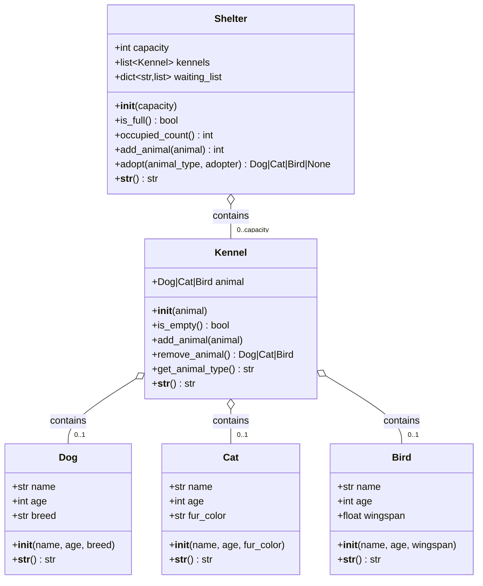

# UML Class Diagram — Animal Shelter

Containment relationships only. **No inheritance** between any classes.
The `Shelter` *has* up to `capacity` `Kennel`s, and each `Kennel` *has-a*
(contains) at most one of: `Dog`, `Cat`, or `Bird`. The `Shelter` also keeps
a per-type waiting list of adopter names.



## ASCII fallback (containment connectors)

```
+---------------+   contains    +-----------+   contains   +-----------+
|    Shelter    |<>-------------|  Kennel   |<>------------|    Dog    |
|---------------| 0..capacity   |-----------|              +-----------+
| capacity      |               | animal    |   contains   +-----------+
| kennels       |               | isEmpty() |<>------------|    Cat    |
| waiting_list  |               | add()     |              +-----------+
| addAnimal()   |               | remove()  |   contains   +-----------+
| adopt()       |               | getType() |<>------------|   Bird    |
+---------------+               +-----------+              +-----------+
```

**Legend**
- `o--` / `<>----` : aggregation (containment) — Shelter HAS Kennels; a Kennel HAS-A animal.
- `0..capacity` / `0..1` : multiplicities — kennels are capped by capacity; a kennel holds at most one animal.
- No `--|>` arrows: there is **no inheritance** between any classes.
