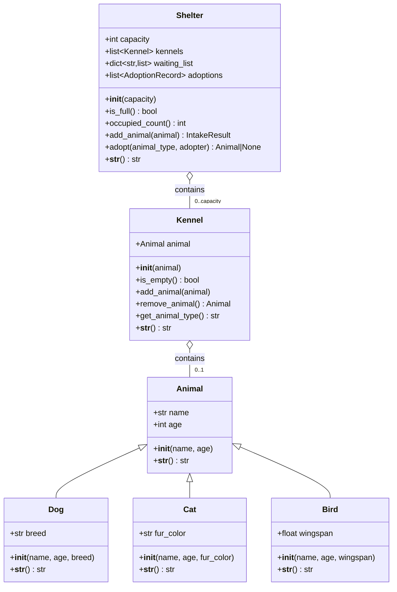

# UML Class Diagram — Animal Shelter

Two relationship kinds, each used where it belongs:

- **Inheritance (is-a):** `Dog`, `Cat`, and `Bird` extend the `Animal`
  base class, which holds the shared `name`, `age`, and `__str__`.
- **Containment (has-a):** the `Shelter` *has* up to `capacity`
  `Kennel`s, and each `Kennel` *has-an* `Animal`. The `Shelter` also
  keeps a per-type waiting list and an adoption log.



## ASCII fallback

```
                                +-------------+
                                |   Animal    |
                                |-------------|
                                | name        |
                                | age         |
                                | __str__()   |
                                +-------------+
                                      ^
                     is-a             | (inheritance)
              +-----------------------+-----------------------+
              |                       |                       |
        +-----------+           +-----------+           +-----------+
        |    Dog    |           |    Cat    |           |   Bird    |
        |-----------|           |-----------|           |-----------|
        | breed     |           | fur_color |           | wingspan  |
        +-----------+           +-----------+           +-----------+

+---------------+   contains    +-----------+   contains   +-----------+
|    Shelter    |<>-------------|  Kennel   |<>------------|  Animal   |
|---------------| 0..capacity   |-----------|    0..1      +-----------+
| capacity      |               | animal    |
| kennels       |               | isEmpty() |
| waiting_list  |               | add()     |
| adoptions     |               | remove()  |
| addAnimal()   |               | getType() |
| adopt()       |               +-----------+
+---------------+
```

**Legend**
- `--|>` / `^` : inheritance — Dog, Cat, and Bird ARE Animals.
- `o--` / `<>----` : aggregation (containment) — Shelter HAS Kennels; a Kennel HAS-AN Animal.
- `0..capacity` / `0..1` : multiplicities — kennels are capped by capacity; a kennel holds at most one animal.
